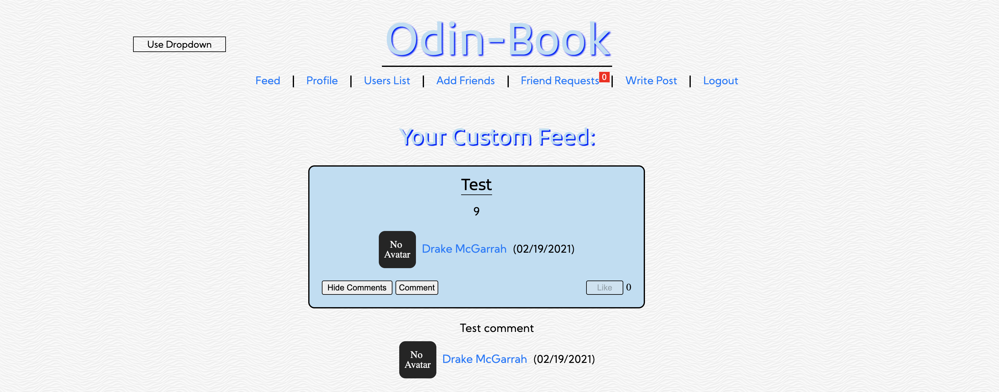

# Odin-Book

Deployed: https://phoenix-99hp.github.io/odin-book-v2/

This is a site similar to Facebook that I made while following the Odin Project's Full-Stack Javascript Curriculum (https://www.theodinproject.com) hence the name "Odin-Book". The front-end of the site was built using React as a framework, and the back-end was built using Node.js/Express/MongoDB. Some of the features of this site are a feed where posts from the current user and the user's friends appear, an option to upload an avatar or profile image, and the ability to toggle between an action bar or dropdown menu for navigation. Users can also write or comment on posts, send friend requests, and view a list of all registered users.

